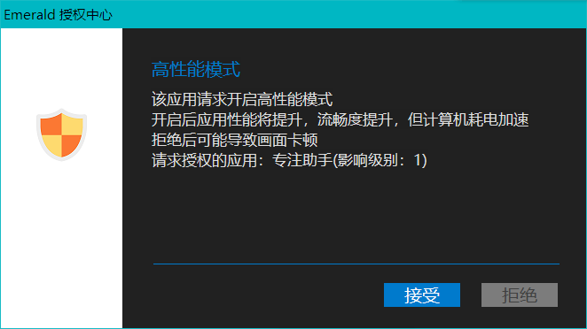
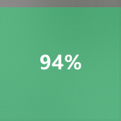

# Focuser
强迫你认真看网课工具。  
# 部署
直接下载直接解压，双击打开EXE即可。  
* 为什么需要管理员身份权限？  
为了更有效地监督你学习。
# 使用方法
* 第一步

双击EXE，提示开启高性能模式，选择是否都可以。  
* 第二步

设置你的专注结束时间（点击界面上的数字或拖动），也就是下课时间。  
* 第三步

设置`专注百分比`，即看网课的时间占使用电脑时间的百分比，如果你对自己很严格，可以设置为100%。  
* 第四步

默认禁用**强迫模式**，您可以选择启用，启用后您就只能乖乖听网课。（如果还有一台手机在身边就当我没说）  
* 第五步

**把你的鼠标放在网课界面上面**，然后等待6秒钟。
* 第六步
`专注百分比`将显示在右下角

当你的专注度远高于你的目标时，颜色为**绿色**；

当你的专注度基本在你的预期内时，颜色为**黄色**；

当你的专注度低于你的目标时，颜色为**红色**。
此处如果开启强迫模式，程序将参与监督，最小化您网课以外的所有窗口并且锁定鼠标的位置。
# 注意
**您可以按键盘上的Esc键退出程序。但在强迫模式下无效。**  
您在强迫模式下依然可以借助Ctrl+Alt+Del强制注销，但那意味着你必须关掉所有打开的东西，包括你未保存的工作。  
**如果只是为了尝试**，建议先不要开启**强迫模式**，以免自己的电脑被锁死。  
* 被进入强迫模式后，我的电脑会出问题吗？  
不会，当您设置的专注时间达到时，程序将自动退出并解除，或者您可以马上继续认真听网课来提升你的`专注百分比`。